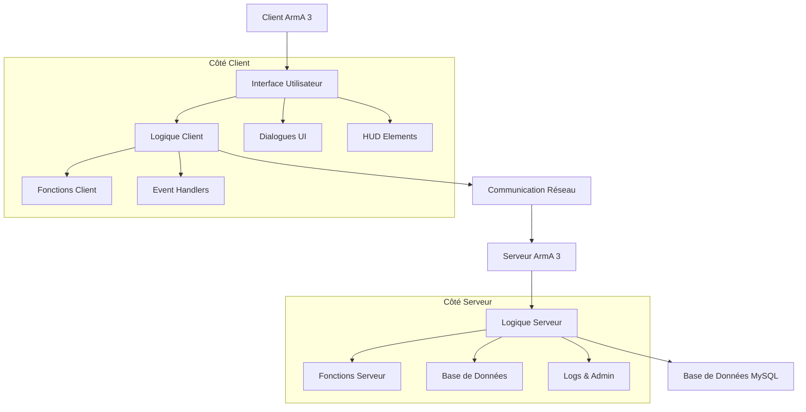
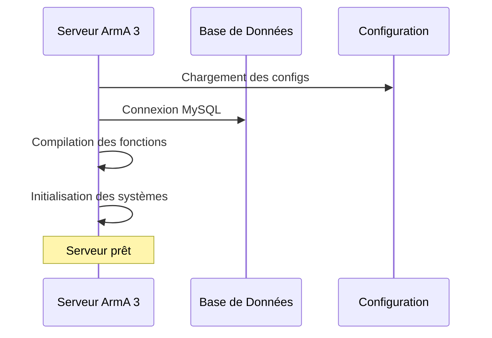
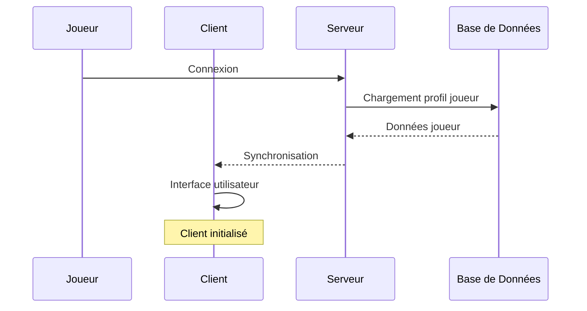
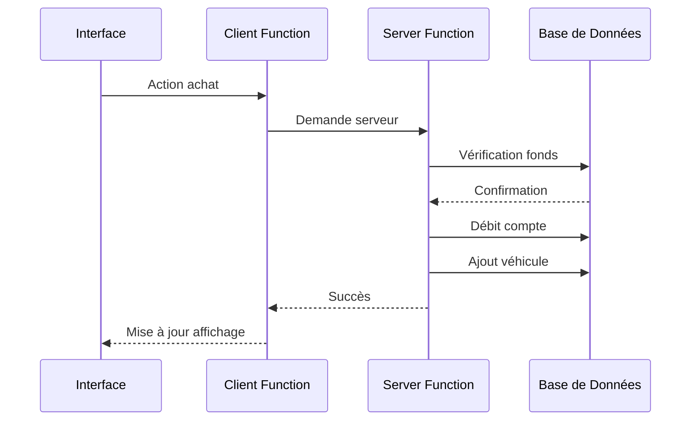
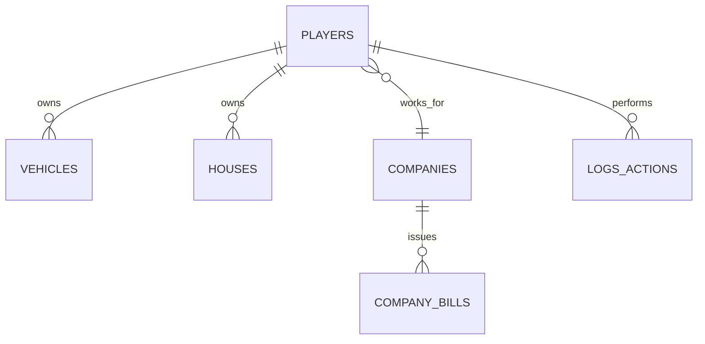
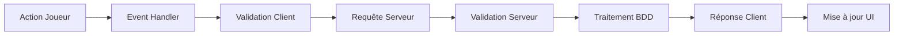

# 🏗️ Architecture du Framework - ArmA 3 Project Life

## 📐 Vue d'Ensemble de l'Architecture

Le framework **ArmA 3 Project Life** suit une architecture **client-serveur modulaire** avec séparation des responsabilités entre l'interface utilisateur, la logique métier et la persistance des données.



---

## 🗂️ Structure des Dossiers

### Hiérarchie Principale
```
framework/
├── 📂 Server Files/                    # Code source principal
│   ├── 📂 PO.FishersIsland/           # Client-side (Mission)
│   │   ├── 📂 Configs/                # Configurations client
│   │   ├── 📂 Dialogs/                # Interfaces utilisateur
│   │   ├── description.ext            # Configuration mission
│   │   ├── init.sqf                   # Initialisation client
│   │   └── mission.sqm                # Données de carte
│   │                                  
│   └── 📂 PO_Backend/                 # Server-side (Framework)
│       ├── 📂 Compiler/               # Système de compilation
│       ├── 📂 Content/                # Contenu principal
│       │   ├── 📂 Configs/           # Configurations système
│       │   ├── 📂 Functions/         # Fonctions client
│       │   └── 📂 Server/            # Fonctions serveur
│       └── config.cpp                 # Configuration addon
│
├── 📂 Configs/                        # Configuration serveur ArmA 3
├── 📂 SQL/                           # Structure base de données
├── 📂 Sources TFAR/                  # Communications radio
└── 📂 PBOManager/                    # Outils de compilation
```

---

## 🔄 Flux de Données

### 1. Initialisation du Serveur


### 2. Connexion Joueur


### 3. Action Joueur (Exemple: Achat véhicule)


---

## 🧩 Architecture Modulaire

### Modules Client (Functions/)
Les 82+ modules client sont organisés par domaine fonctionnel :

#### Modules Principaux
```
PO_Admin.sqf          # Administration
PO_Bank.sqf           # Système bancaire
PO_Business.sqf       # Entreprises
PO_Company.sqf        # Gestion entreprises
PO_Faction_*.sqf      # Systèmes de factions
PO_Housing.sqf        # Immobilier
PO_Inventory.sqf      # Inventaire
PO_Job_*.sqf          # Métiers
PO_Phone_*.sqf        # Communications
PO_Vehicle.sqf        # Véhicules
```

#### Structure Type d'un Module
```sqf
/*
    Nom du fichier: PO_Example.sqf
    Auteur: POLARION
    Description: Description du module
    
    Fonctions exportées:
    - PO_fnc_exampleInit
    - PO_fnc_exampleProcess
    - PO_fnc_exampleCleanup
*/

// Variables globales du module
PO_Example_Data = [];
PO_Example_Config = [];

// Fonction d'initialisation
PO_fnc_exampleInit = {
    // Code d'initialisation
};

// Fonctions principales
PO_fnc_exampleProcess = {
    // Logique métier
};

// Export des fonctions
publicVariable "PO_fnc_exampleInit";
publicVariable "PO_fnc_exampleProcess";
```

### Modules Serveur (Server/)
Les 40+ modules serveur gèrent la logique métier :

```
Server_Core.sqf           # Noyau serveur
Server_Database.sqf       # Gestion BDD
Server_Player.sqf         # Gestion joueurs
Server_Vehicle.sqf        # Véhicules serveur
Server_Housing.sqf        # Immobilier serveur
Server_Admin.sqf          # Administration
Server_Log.sqf            # Logs système
```

---

## 🎛️ Système de Configuration

### Hiérarchie des Configurations
```
1. Config_Master.sqf      # Configuration principale
2. Config_*.sqf           # Configurations spécialisées
3. description.ext        # Configuration mission
4. server.cfg            # Configuration serveur ArmA
```

### Exemple de Configuration
```sqf
// Config_Master.sqf
class POConfig {
    // Paramètres économiques
    class Economy {
        startingMoney = 5000;
        salaryMultiplier = 1.0;
        taxRate = 0.15;
    };
    
    // Paramètres gameplay
    class Gameplay {
        maxWeight = 250;
        respawnTime = 300;
        jailTime = 3600;
    };
    
    // Intégrations
    class Integrations {
        useTFAR = true;
        useAdvancedMedical = false;
    };
};
```

---

## 🗄️ Architecture Base de Données

### Schéma Principal
```sql
-- Tables principales
companies           # Entreprises
players            # Profils joueurs
vehicles           # Véhicules possédés
houses             # Propriétés immobilières
companies_bills    # Factures entreprises
gang_data          # Données des gangs
logs_*             # Tables de logs

-- Tables de configuration
server_settings    # Paramètres serveur
economy_settings   # Configuration économique
```

### Relations Clés


---

## 🔌 Système de Communication

### Communication Client-Serveur
```sqf
// Côté Client -> Serveur
["functionName", [parameters]] remoteExecCall ["Server_Function", 2];

// Côté Serveur -> Client
["functionName", [parameters]] remoteExecCall ["Client_Function", _target];

// Événements globaux
["EventName", [data]] call CBA_fnc_globalEvent;
```

### Architecture des Événements


---

## 🛡️ Sécurité et Validation

### Principe de Sécurité
- **Client** : Interface et affichage uniquement
- **Serveur** : Toute logique métier et validation
- **Base de Données** : Source de vérité unique

### Validation en Couches
```sqf
// 1. Validation côté client (UX)
if (!_hasPermission) exitWith {
    hint "Permission refusée";
};

// 2. Validation côté serveur (Sécurité)
if (!([_player] call PO_fnc_hasPermission)) exitWith {
    [_player, "SECURITY_VIOLATION"] call Server_Log;
};

// 3. Validation base de données (Intégrité)
// contraintes SQL et procédures stockées
```

---

## 🔧 Extensibilité

### Ajout d'un Nouveau Module

#### 1. Structure du Module
```sqf
// PO_NewModule.sqf
class PO_NewModule {
    // Configuration
    class Config {
        enabled = true;
        parameter1 = "value";
    };
    
    // Fonctions
    class Functions {
        init = "PO_fnc_newModuleInit";
        process = "PO_fnc_newModuleProcess";
    };
};
```

#### 2. Intégration
```sqf
// Dans Config_Master.sqf
#include "PO_NewModule.sqf"

// Dans init.sqf
[] call PO_fnc_newModuleInit;
```

#### 3. Base de Données
```sql
-- Nouvelle table si nécessaire
CREATE TABLE new_module_data (
    id INT AUTO_INCREMENT PRIMARY KEY,
    player_id VARCHAR(50),
    data TEXT,
    created_at TIMESTAMP DEFAULT CURRENT_TIMESTAMP
);
```

### Hooks et Événements
```sqf
// Système d'événements extensible
["PlayerConnected", {
    params ["_player"];
    // Traitement personnalisé
}] call CBA_fnc_addEventHandler;

["VehiclePurchased", {
    params ["_player", "_vehicle", "_price"];
    // Logique personnalisée
}] call CBA_fnc_addEventHandler;
```

---

## 📊 Performance et Optimisation

### Bonnes Pratiques

#### 1. Gestion Mémoire
```sqf
// Nettoyage périodique
addMissionEventHandler ["HandleDisconnect", {
    params ["_player"];
    [_player] call PO_fnc_cleanupPlayerData;
}];
```

#### 2. Optimisation Base de Données
```sql
-- Index sur colonnes fréquemment utilisées
CREATE INDEX idx_players_steamid ON players(steamid);
CREATE INDEX idx_vehicles_owner ON vehicles(owner_id);
```

#### 3. Cache et Buffers
```sqf
// Cache des données fréquemment accédées
PO_PlayerCache = createHashMap;
PO_VehicleCache = createHashMap;

// Invalidation du cache
PO_fnc_invalidateCache = {
    params ["_type", "_id"];
    switch (_type) do {
        case "player": { PO_PlayerCache deleteAt _id; };
        case "vehicle": { PO_VehicleCache deleteAt _id; };
    };
};
```

---

## 🔄 Cycle de Vie

### Démarrage Serveur
1. **Pré-initialisation** : Chargement configs
2. **Connexion BDD** : Établissement connexions
3. **Compilation** : Fonctions et modules  
4. **Initialisation** : Systèmes de jeu
5. **Prêt** : Acceptation joueurs

### Connexion Joueur
1. **Authentification** : Vérification Steam ID
2. **Chargement Profil** : Données depuis BDD
3. **Synchronisation** : Envoi données client
4. **Initialisation UI** : Interfaces utilisateur
5. **Événements** : Handlers et listeners

### Déconnexion Joueur
1. **Sauvegarde** : Données en base
2. **Nettoyage** : Variables et objets
3. **Logs** : Enregistrement déconnexion
4. **Libération** : Ressources serveur

---

Cette architecture modulaire et évolutive permet au framework ArmA 3 Project Life de maintenir des performances optimales tout en offrant une expérience de roleplay riche et immersive.